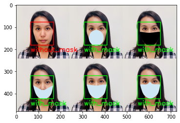
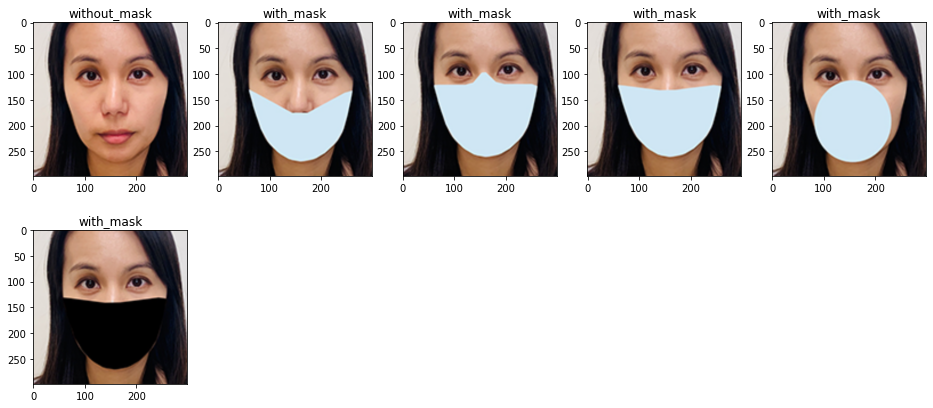

# Face Recognition Use Case Detect People Wearing Mask or Not (Using ResNet50 + Compile into ONNX)

## Introduction

Masks play a crucial role in protecting the health of individuals against respiratory diseases, as is one of the few precautions available for COVID-19 in the absence of immunization.

This application currently still writen in ```jupyter notebook```, you can read teh code or notebook at ```notebooks``` directory.

<p align="center">
    
</p>

<p align="center">
    
</p>

## Datasets

Data set consists of 7553 RGB images in 2 folders as withmask and withoutmask. Images are named as label withmask and withoutmask. Images of faces with mask are 3725 and images of faces without mask are 3828. Data source from https://www.kaggle.com/omkargurav/face-mask-dataset

The classes are:

- With mask: 3725 Images
- Without mask: 3828 Images

## Conslusion

The most noticeable is the faster processing time of models that have been converted to ONNX. In addition to the things that have been learned about ONNX, there are several other advantages of using ONNX including:

- Improvement in inference performance, inference time is considerably reduced.
- Reduced training time.
- Develop and train models in Python and deploy in C, C ++ or Java based applications.